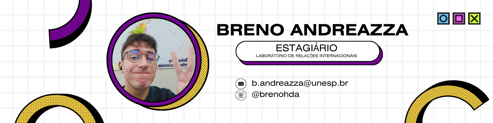

## Oioi, que bom te ver por aqui! 👋

 Eu me chamo Breno, mas também podem me chamar de Toddy pela faculdade 😊 Atualmente sou estagiário do Laboratório de Relações Internacionais da Unesp de Franca,   
tenho atuado tanto como gestor de redes sociais, e também como analista de dados, aprendando a realizar coletas e organizar informações. Entrei na área da tecnologia no meu ensino médio,
lá em 2021, por ter tido contato com a ETEC de Santa Fé do Sul (minha cidade natal 🌟) e ter feito um ensino técnico em Informática para Internet, o que abriu todo esse novo mundo para mim. 
 

<!--
**brenohda/brenohda** is a ✨ _special_ ✨ repository because its `README.md` (this file) appears on your GitHub profile.

Here are some ideas to get you started:

- 🔭 I’m currently working on ...
- 🌱 I’m currently learning ...
- 👯 I’m looking to collaborate on ...
- 🤔 I’m looking for help with ...
- 💬 Ask me about ...
- 📫 How to reach me: ...
- 😄 Pronouns: ...
- ⚡ Fun fact: ...
-->
